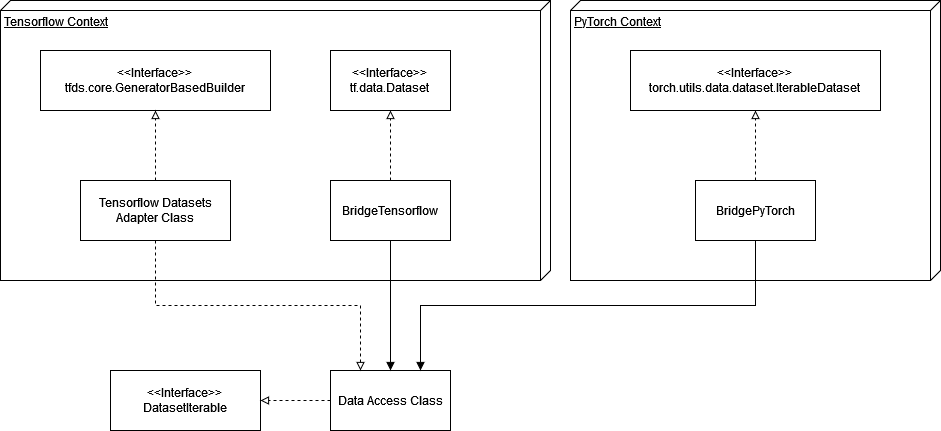

### Description
This repository contains code to make datasets stored on th corpora network drive of the chair
compatible with the [tensorflow dataset api](https://www.tensorflow.org/api_docs/python/tf/data/Dataset).
Pytorch Dataset [is also supported](https://pytorch.org/vision/stable/datasets.html).
 
### Currently available Datasets

| Dataset       | Status        | Url  |
| :------------- |:-------------:| :-----|
| ckplus        | ✅             | http://www.iainm.com/publications/Lucey2010-The-Extended/paper.pdf |
| affectnet     | ✅             | http://mohammadmahoor.com/affectnet/ |
| faces         | ✅             |    https://faces.mpdl.mpg.de/imeji/ |
| nova_dynamic  | ✅             |    https://github.com/hcmlab/nova |
| audioset      | ❌             | https://research.google.com/audioset/ |
| is2021_ess    | ❌             |    -|
| librispeech   | ❌             |    https://www.openslr.org/12 |


## Tensorflow Dataset API

### Example Usage

```python
import os
import tensorflow as tf
import tensorflow_datasets as tfds
import hcai_datasets
from matplotlib import pyplot as plt

# Preprocessing function
def preprocess(x, y):
  img = x.numpy()
  return img, y

# Creating a dataset
ds, ds_info = tfds.load(
  'hcai_example_dataset',
  split='train',
  with_info=True,
  as_supervised=True,
  builder_kwargs={'dataset_dir': os.path.join('path', 'to', 'directory')}
)

# Input output mapping
ds = ds.map(lambda x, y: (tf.py_function(func=preprocess, inp=[x, y], Tout=[tf.float32, tf.int64])))

# Manually iterate over dataset
img, label = next(ds.as_numpy_iterator())

# Visualize
plt.imshow(img / 255.)
plt.show()
```

### Example Usage Nova Dynamic Data
```python
import os
import hcai_datasets
import tensorflow_datasets as tfds
from sklearn.svm import LinearSVC
import numpy as np
from sklearn.calibration import CalibratedClassifierCV
import warnings
warnings.simplefilter("ignore")

## Load Data
ds, ds_info = tfds.load(
  'hcai_nova_dynamic',
  split='dynamic_split',
  with_info=True,
  as_supervised=True,
  data_dir='.',
  read_config=tfds.ReadConfig(
    shuffle_seed=1337
  ),
  builder_kwargs={
    # Database Config
    'db_config_path': 'nova_db.cfg',
    'db_config_dict': None,

    # Dataset Config
    'dataset': '<dataset_name>',
    'nova_data_dir': os.path.join('C:', 'Nova', 'Data'),
    'sessions': ['<session_name>'],
    'roles': ['<role_one>', '<role_two>'],
    'schemes': ['<label_scheme_one'],
    'annotator': '<annotator_id>',
    'data_streams': ['<stream_name>'],

    # Sample Config
    'frame_step': 1,
    'left_context': 0,
    'right_context': 0,
    'start': None,
    'end': None,
    'flatten_samples': False, 
    'supervised_keys': ['<role_one>.<stream_name>', '<scheme_two>'],

    # Additional Config
    'clear_cache' : True
  }
)

data_it = ds.as_numpy_iterator()
data_list = list(data_it)
data_list.sort(key=lambda x: int(x['frame'].decode('utf-8').split('_')[0]))
x = [v['<stream_name>'] for v in data_list]
y = [v['<scheme_two'] for v in data_list]

x_np = np.ma.concatenate( x, axis=0 )
y_np = np.array( y )

linear_svc = LinearSVC()
model = CalibratedClassifierCV(linear_svc,
                               method='sigmoid',
                               cv=3)
print('train_x shape: {} | train_x[0] shape: {}'.format(x_np.shape, x_np[0].shape))
model.fit(x_np, y_np)
```

## Pytorch API

### Example usage

```python
from configparser import ConfigParser

from torch.utils.data import DataLoader

from hcai_dataset_utils.bridge_pytorch import BridgePyTorch
from hcai_datasets.hcai_affectnet.hcai_affectnet_iterable import HcaiAffectnetIterable

if __name__ == "__main__":

    config = ConfigParser()
    config.read("config.ini")

    iterable = HcaiAffectnetIterable(
        dataset_dir=config["directories"]["data_dir"] + "/AffectNet",
        split="test"
    )
    dataloader = DataLoader(BridgePyTorch(iterable))

    for i, sample in enumerate(dataloader):
        if i > 0:
            break
        print(sample)
```


## Plain Tensorflow API

### Example usage

```python
from configparser import ConfigParser
from hcai_dataset_utils.bridge_tf import BridgeTensorflow
import tensorflow as tf
from hcai_datasets.hcai_faces.hcai_faces_iterable import HcaiFacesIterable

if __name__ == "__main__":

    config = ConfigParser()
    config.read("config.ini")

    iterable = HcaiFacesIterable(
        dataset_dir=config["directories"]["data_dir"] + "/FACES",
        split="test"
    )
    dataset = BridgeTensorflow.make(iterable)

    # cast to supervised tuples
    dataset = dataset.map(lambda s: (s["image"], s["emotion"]))
    # open files, resize images, one-hot vectors
    dataset = dataset.map(lambda x, y: (
        tf.image.resize(
            tf.image.decode_image(tf.io.read_file(x), channels=3, dtype=tf.uint8, expand_animations=False),
            size=[224, 224]
        ),
        tf.one_hot(y, depth=6)
    ))
    # batch
    dataset = dataset.batch(32, drop_remainder=True)

    # premade efficientnet
    efficientnet = tf.keras.applications.EfficientNetB0(
        include_top=True,
        weights=None,
        classes=6,
        classifier_activation="softmax"
    )
    efficientnet.compile(optimizer="adam", loss="categorical_crossentropy")
    efficientnet.fit(dataset, epochs=1)
```


## Architecture considerations



Dataset implementations are split into two parts.\
Data access is handled by a generic python iterable, implemented by the DatasetIterable interface.\
The access class is then extended by an API class, which implements tfds.core.GeneratorBasedBuilder.
This results in the dataset being available by the Tensorflow Datasets API, and enables features 
such as local caching.

The iterables themselves can also be used as-is, either in PyTorch native DataGenerators by wrapping them in
the utility class BridgePyTorch, or as tensorflow-native Datasets by passing them to BridgeTensorflow.

The benefits of this setup are that a pytorch application can be served without installing or loading 
tensorflow, and vice versa, since the stack up to the adapters does not involve tf or pytorch. 
Also, when using tf, caching can be used or discarded by using tfds or the plain tensorflow Dataset
provided by the bridge.